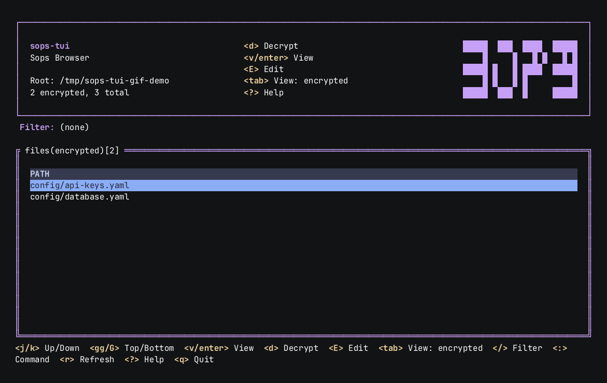

# sops-tui

Working with [SOPS](https://github.com/getsops/sops) day to day usually means a lot of
`sops -d file.yaml | less`, `sops -e -i file.yaml`, and squinting at a directory listing trying to
remember which files are actually encrypted. There's no single place to see the state of your
secrets across a repo, and every action is its own one-off shell command.

sops-tui gives that a home: a [k9s](https://k9scli.io/)-style terminal UI that scans a directory,
shows every `.yaml`/`.yml`/`.json` file it finds, and tells you at a glance which are encrypted
and which aren't. From there you navigate with the keyboard — `j`/`k` to move, `Tab` to switch
between encrypted/plaintext/all, `v` to peek at decrypted content, `e`/`d` to encrypt or decrypt,
`E` to edit — all backed by your own `sops` binary and `.sops.yaml`, so nothing here reimplements
or second-guesses how sops itself behaves. Every write is confirmed on its own screen first, and
viewing never touches disk.

## Features

- Flat, k9s-style table with vim-style navigation
- `Tab`-cycled views — **encrypted**, **plaintext**, **all** — so encrypt/decrypt candidates are
  never mixed up
- Read-only decrypted view that never writes plaintext to disk
- Encrypt/decrypt in place, each behind its own confirmation screen
- Edit via `sops <file>` (suspends the TUI, runs your `$EDITOR` through sops, re-encrypts on save)
- Live filtering by path and a `:` command mode
- Catppuccin Macchiato theme

## Where to go next

- [Getting Started](getting-started.md) — install it and point it at a directory
- [Usage](usage.md) — views, filtering, command mode
- [Keybindings](keybindings.md) — the full key reference
- [Architecture](ARCHITECTURE.md) — package layout and internals, for contributors
